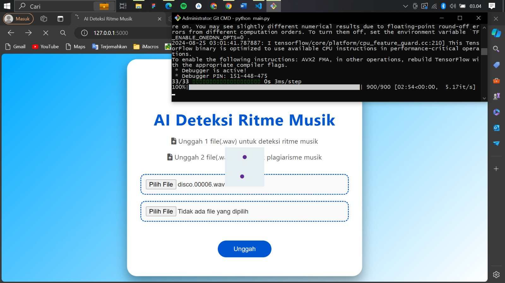
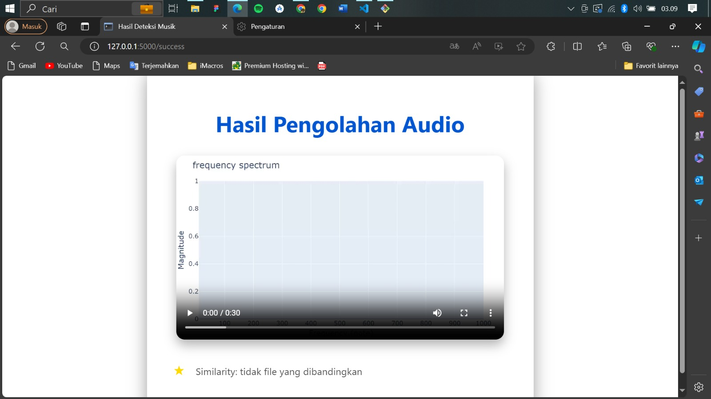
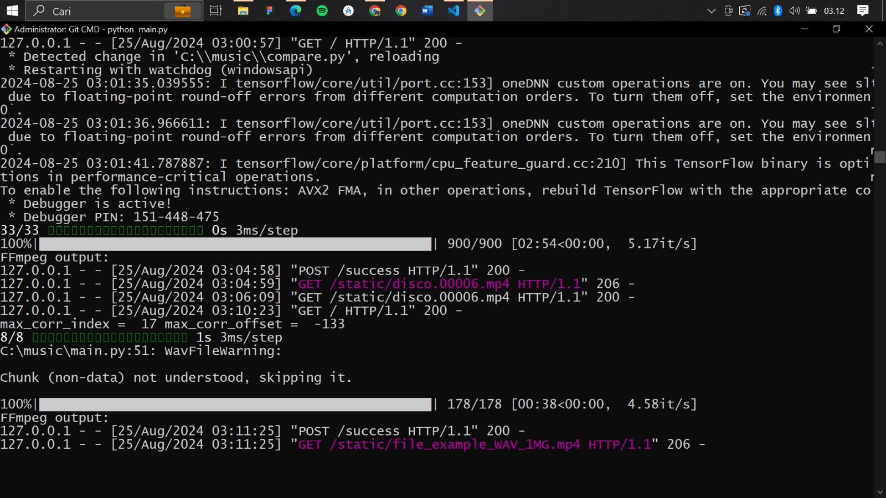

# Deteksi Ritme Musik

**Deteksi Ritme Musik** adalah project berbasis **Python** yang digunakan untuk menganalisis dan mendeteksi **pola ritme musik** dengan memanfaatkan pemrosesan sinyal audio dan pendekatan **Deep Learning**.

---
<table align="center"> <tr> <td align="center">   <b>Preview</b> </td> <td align="center">   <b>Hasil Deteksi</b> </td> </tr> <tr> <td align="center">   <b>Hasil Similarity</b> </td> <td align="center">   <b>Output Terminal</b> </td> </tr> </table>
